# Prototype — YummyNaKha!

- Date: 2026-09-08 (W4→W5, DISCOVER)
- Prototype: **Figma Make — "Execute action", Version 7**
  <https://www.figma.com/make/NEV4YbRQ9WN1m3MDkAdZsp/Execute-action>
- Source spec: [20260907-01-menu-scan-personalization.md](../01-requirements/01-spec/20260907-01-menu-scan-personalization.md)
- Feature list: [01-feature-list.md](01-feature-list.md)
- User journey: [02-user-journey.md](02-user-journey.md)

This document records **what the prototype actually does**. Screens, copy, and
states below were read off the running Figma Make prototype, not designed on
paper. Where the prototype and the requirement spec disagree, the disagreement
is listed in [Prototype vs. requirements](#prototype-vs-requirements--open-gaps)
rather than hidden.

The prototype is a **clickable front-end only**. Sign-in, menu images, OCR,
translation and matching are simulated in the browser; there is no backend, no
real Google OAuth call, and no real AI provider call yet.

---

## Terminology — prototype label ↔ requirement term

The prototype uses friendlier words than the spec. These are the same things.
Use the **prototype label** in UI copy and the **requirement term** in specs.

| Prototype label | Requirement term | Traces |
|---|---|---|
| My Taste | food profile | F2, F3, F4 |
| Favs / Your Favs | favorite foods and ordinary preferences | F2 |
| Avoid list | dislikes **plus** allergies and doctor-advised restrictions | F2, F3 |
| Avoid reason: *Just don't like it* | ordinary preference — normal personal data | F2, LR1 |
| Avoid reason: *Allergy* / *Doctor advised* | potentially sensitive health data | F3, LR1 |
| Top Picks | 🟢 recommended | F9 |
| Check First | 🟡 check before ordering | F9, F10 |
| Avoid *(result badge)* | 🔴 conflict | F9 |
| Find My Food | run the scan | F5, F6 |
| Show in Thai / Order in Thai | selected-menu page in Thai | F14 |
| About food warnings | AI & Accuracy Disclaimer wording | LR11, LR12 |

**Note the collision:** *Avoid* is both a profile list and a result category.
In writing, always qualify: "the **Avoid list**" (profile) vs. "an **Avoid
dish**" (result).

---

## Roles and permissions

| Role | In the prototype | Can do | Cannot do |
|---|---|---|---|
| **Traveller / Diner** (only signed-in role) | every screen after Auth | manage own Favs and Avoid list, upload menu photos, run the analysis, browse and filter results, open dish details, build and edit an order, show the order in Thai, edit username, change password, sign out | see anyone else's profile, order or menu; there is no sharing, no other user's data anywhere in the prototype |
| **Restaurant Staff** | not a user of the app | read the *Order in Thai* screen from the diner's device | nothing else — staff never sign in, and the app stores nothing about them |
| **Google / Auth Service** | external system | verify identity, return a session | never receives menu or profile data |
| **Guest (not signed in)** | Welcome + Auth screens only | reach Welcome, Sign In, Create account, Reset password | reach Home, My Taste, Menu, My Order, Order in Thai or Profile |

There is **no admin, moderator or restaurant-side role** anywhere in the
prototype — consistent with F25 (Won't).

---

## Screen map and navigation

```text
Welcome ──► Auth ────────────────► My Taste (onboarding) ──► Home
             ├─ Sign In                                        │
             ├─ Create account                                 │
             └─ Reset password                                 │
                                                               ▼
                                    Home ──"Find My Food"──► Analyzing ──► Your Menu
                                     │  ▲                                   │
                                     │  └───────── bottom tab bar ──────────┤
                                     │                                      ▼
                                     │                              Dish Detail (sheet)
                                     │                                      │
                                     ▼                                      ▼
                            My Profile ──► Change Password        My Order ──► Order in Thai
```

- **Bottom tab bar — `Home` · `My Order` · `My Taste`** — is present on Home,
  Your Menu, My Order and My Taste. `My Order` carries a count badge.
- **No bottom tab bar** on Welcome, the three Auth screens, Analyzing,
  Order in Thai, My Profile and Change Password — those are full-screen.
- **Bottom sheets** (avoid reason, About food warnings, Dish Detail) sit over
  the current screen and are dismissed by tapping the dimmed backdrop.
- **Back arrows** (`‹`) appear on My Profile and Change Password.
  Order in Thai returns with a text link, `← Back to English`.

The same flow, with every decision point, is in
[ActivityDiagram.jpg](#activity-diagram--main-user-activity).

---

## Screens

### S1 · Welcome — *entry* · covers FE1


| | |
|---|---|
| **Copy** | *YummyNaKha!* · "What's yummy for you?" · "Upload a Thai menu. We'll help you find food that fits your taste." |
| **Value bullets** | Set your food preferences once · Upload any Thai menu photo · Get personalized picks in English · Show your order in Thai to staff |
| **Actions** | `Get Started` → S2 |
| **States** | single static state |
| **Traces** | F1, F5, F7, F14 |

### S2 · Sign In · covers FE1

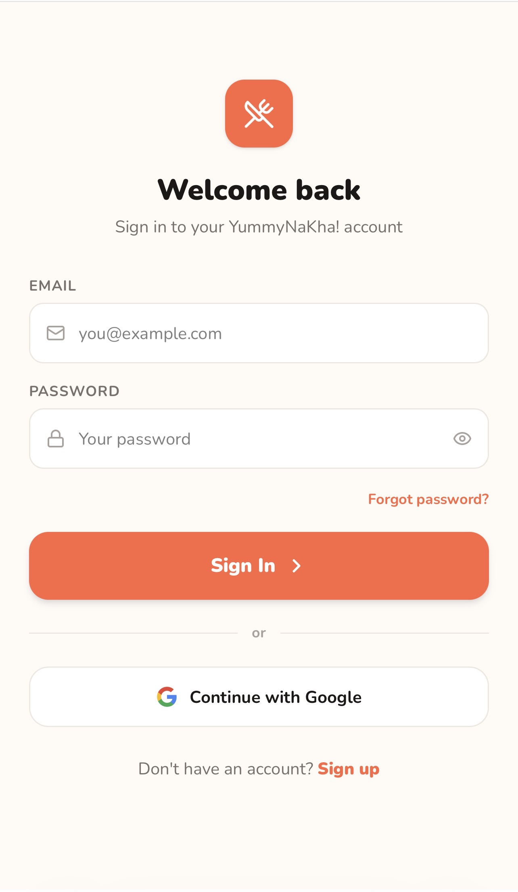

| | |
|---|---|
| **Copy** | *Welcome back* · "Sign in to your YummyNaKha! account" |
| **Fields** | `EMAIL` (placeholder `you@example.com`) · `PASSWORD` (placeholder `Your password`, with a show/hide eye toggle) |
| **Actions** | `Sign In` → S5 · `Forgot password?` → S4 · `Continue with Google` → S5 · `Sign up` → S3 |
| **States** | *empty* · *filled* · *password visible* · **error**: an inline banner "⚠ Please enter your email and password." appears above the button when either field is blank |
| **Traces** | F1, LR6 |

### S3 · Create account · covers FE1

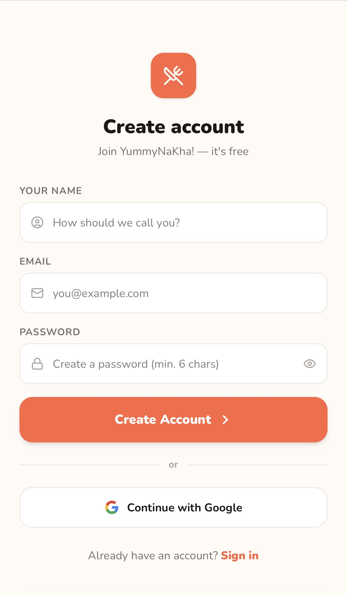

| | |
|---|---|
| **Copy** | *Create account* · "Join YummyNaKha! — it's free" |
| **Fields** | `YOUR NAME` ("How should we call you?") · `EMAIL` · `PASSWORD` ("Create a password (min. 6 chars)") |
| **Actions** | `Create Account` → S5 · `Continue with Google` → S5 · `Sign in` → S2 |
| **States** | *empty* · *filled* · *password visible* · *error* (same inline banner pattern as S2) |
| **Rule shown** | password minimum length is **6 characters** |
| **Traces** | F1, LR6 |

### S4 · Reset password · covers FE1

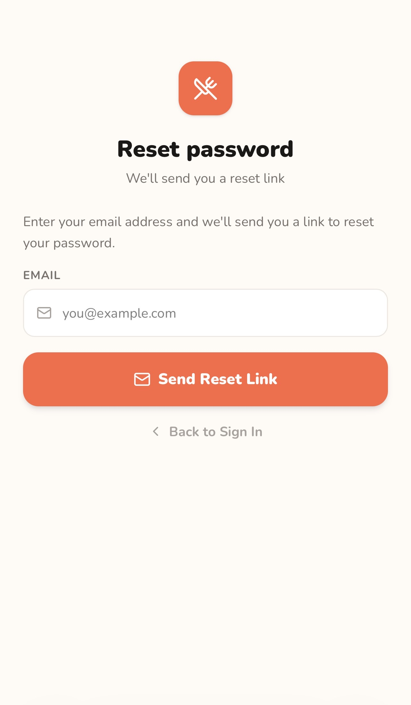

| | |
|---|---|
| **Copy** | *Reset password* · "We'll send you a reset link" · "Enter your email address and we'll send you a link to reset your password." |
| **Actions** | `Send Reset Link` · `← Back to Sign In` → S2 |
| **States** | *empty* · *filled*. The prototype does not yet show a "link sent" confirmation state |
| **Traces** | F1 |

### S5 · My Taste · covers FE1 (F2, F3, F4)

Two tabs in one screen. This is the onboarding step after first sign-in, and the
same screen is reachable later from the `My Taste` tab or the `Edit` link on Home.

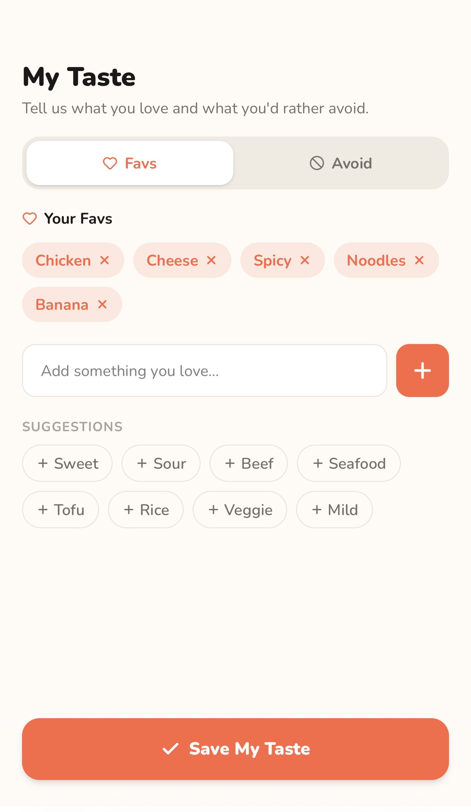
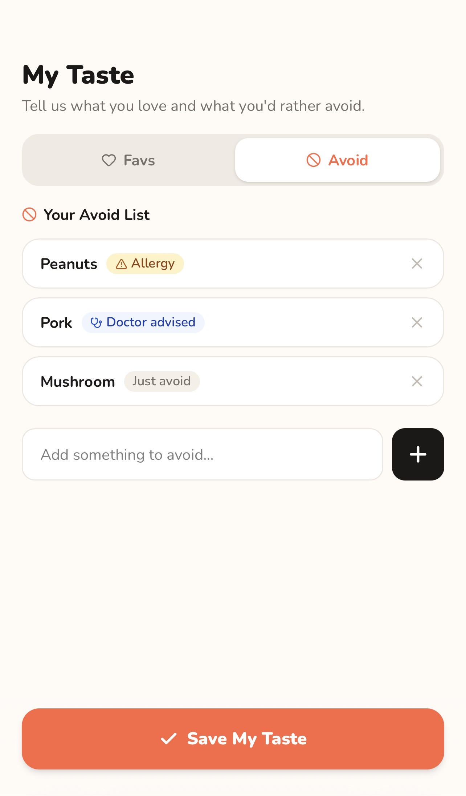

| | |
|---|---|
| **Copy** | *My Taste* · "Tell us what you love and what you'd rather avoid." |
| **Tab — Favs** | *Your Favs*: removable chips (`×`). Free-text field "Add something you love…" plus an add button. `SUGGESTIONS` chips: Sweet · Sour · Beef · Seafood · Tofu · Rice · Veggie · Mild |
| **Tab — Avoid** | *Your Avoid List*: one row per item, each with a reason badge and a `×` to delete. Free-text field "Add something to avoid…" plus an add button |
| **Reason badges** | `⚠ Allergy` (amber) · `🩺 Doctor advised` (blue) · `Just avoid` (grey) |
| **Actions** | `✓ Save My Taste` → S6 |
| **States** | *Favs tab active* · *Avoid tab active* · *empty list* · *populated list* |
| **Traces** | F2, F3, F4, LR1 |

#### S5a · Avoid-reason sheet

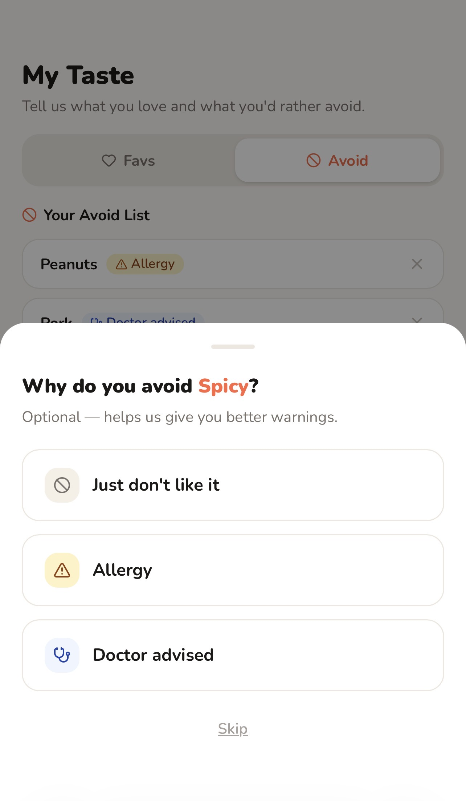

Adding an item to the Avoid list opens a bottom sheet:

| | |
|---|---|
| **Copy** | "Why do you avoid **&lt;item&gt;**?" · "Optional — helps us give you better warnings." |
| **Options** | `Just don't like it` (**pre-selected**) · `Allergy` · `Doctor advised` · `Skip` |
| **Effect** | the chosen reason becomes the row's badge and drives the wording and colour of any later conflict |
| **Traces** | F3, LR1 — **and see gap G2**, because the health reasons are optional and one option is pre-selected |

### S6 · Home · covers FE3 (F5, F19)

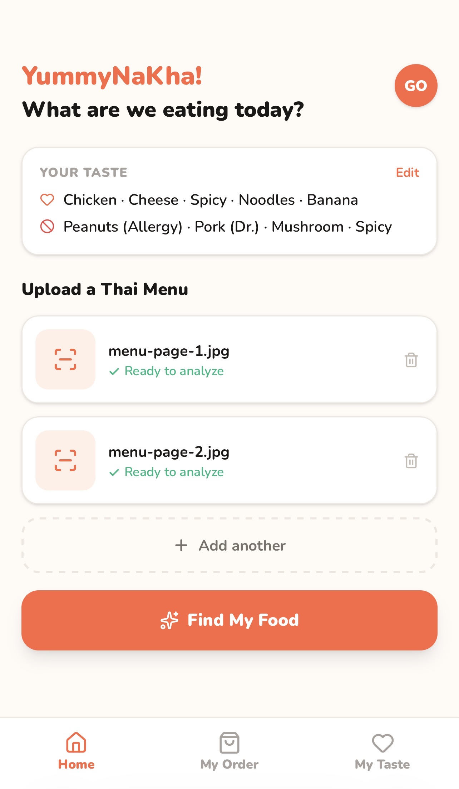

| | |
|---|---|
| **Copy** | *YummyNaKha!* · "What are we eating today?" · *Upload a Thai Menu* |
| **Taste summary** | `YOUR TASTE` card, with `Edit` → S5. Line 1 (♡) lists the Favs; line 2 (⊘) lists the Avoid list with a short reason in brackets — `Peanuts (Allergy) · Pork (Dr.) · Mushroom` |
| **Upload list** | one row per image: thumbnail, file name, `✓ Ready to analyze`, delete (🗑) |
| **Actions** | `+ Add another` (multi-page menus) · `Find My Food` → S7 · avatar (initials) top-right → S11 |
| **States** | **empty** — dashed dropzone "Drop your menu here / or tap to choose menu images", and **no `Find My Food` button is shown**, so an empty scan cannot be submitted; **ready** — one or more rows plus the CTA |
| **Traces** | F5, F19, F26 (partial — see gap G5) |

### S7 · Analyzing · covers FE3–FE5 (F6, F7, F8, F9)

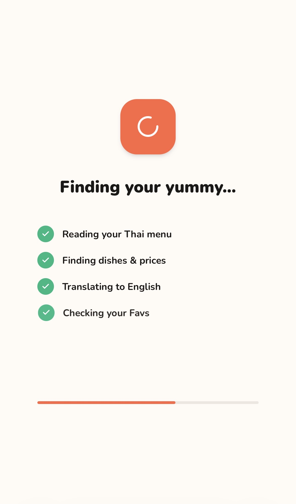

| | |
|---|---|
| **Copy** | *Finding your yummy…* |
| **Six steps, ticked in order** | 1 Reading your Thai menu · 2 Finding dishes & prices · 3 Translating to English · 4 Checking your Favs · 5 Checking your Avoid list · 6 Finding your best picks |
| **Progress** | a bar fills across the six steps; completed steps get a green check, pending steps are dimmed |
| **Actions** | none — the screen advances by itself to S8 |
| **States** | one state per completed step (6) |
| **Traces** | F6, F7, F8, F9, NFR5 |

The six steps are the visible form of the pipeline in
[Architecture.jpg](#architecture-diagram--logical-architecture): image →
OCR → translation → classification → preference matching → ranking.

### S8 · Your Menu — the result · covers FE6 (F9, F10, F11, F12)

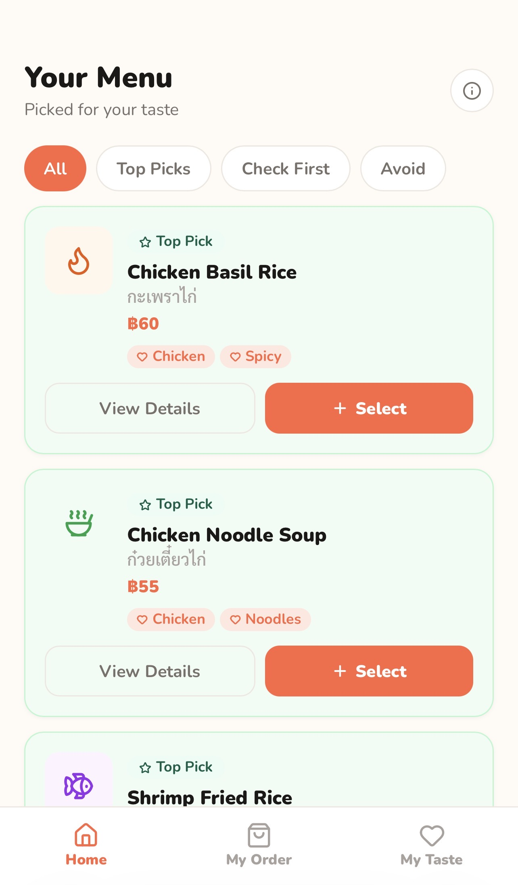
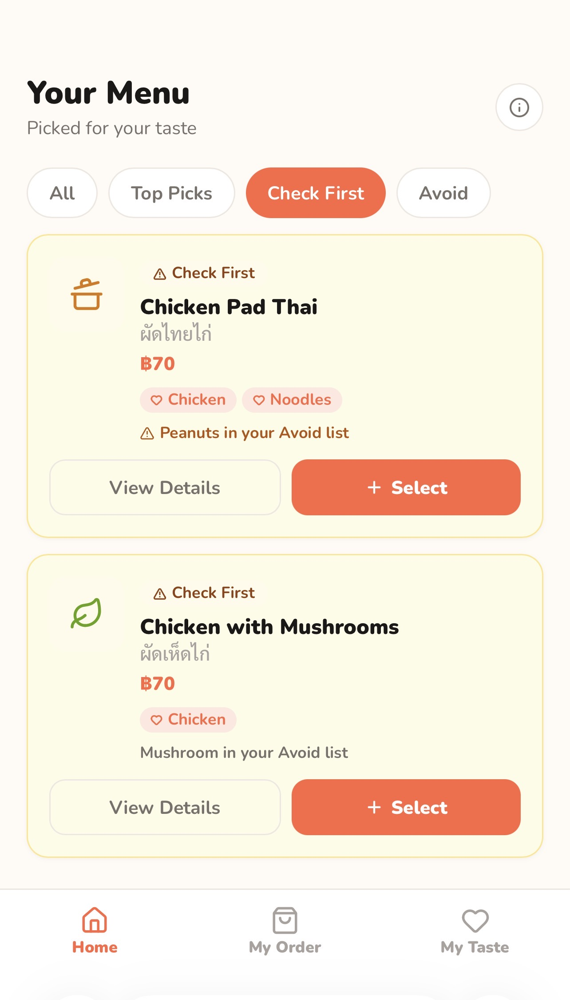
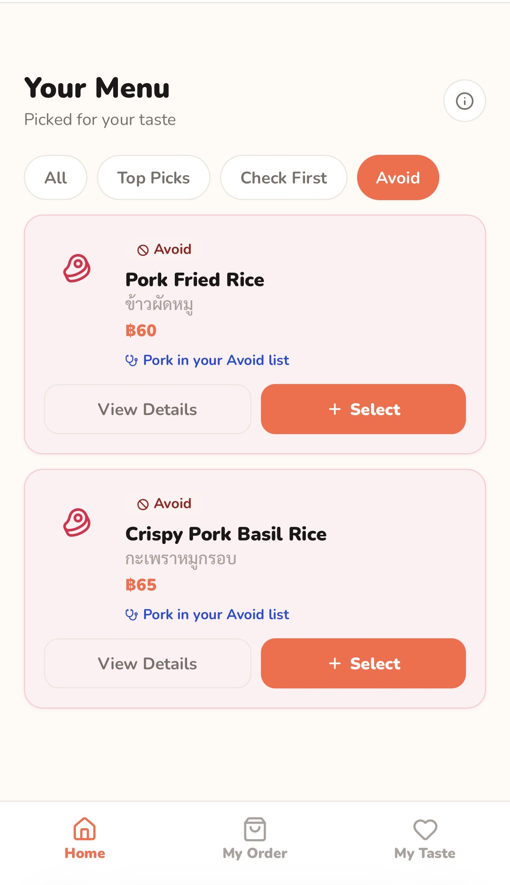

| | |
|---|---|
| **Copy** | *Your Menu* · "Picked for your taste" |
| **Filters** | `All` · `Top Picks` · `Check First` · `Avoid` — the active chip is filled coral |
| **Ordering** | cards are always sorted **Top Picks → Check First → Avoid**, in every filter view |
| **Card** | category badge · English dish name · **Thai dish name** · price in ฿ · matched Fav chips (`♡ Chicken`) · a conflict line when relevant (`⚠ Peanuts in your Avoid list`, `🩺 Pork in your Avoid list`) · `View Details` → S9 · `+ Select` |
| **Card colours** | Top Picks green (`#F0FDF4` on `#BBF7D0`) · Check First yellow (`#FEFCE8` on `#FDE68A`) · Avoid red (`#FFF1F2` on `#FECDD3`); the selected state deepens the tint so the coral selection ring still reads |
| **Actions** | ⓘ (top right) → S8a · filter chips · `View Details` · `+ Select` (adds straight to the order) |
| **States** | *All* · one state per filter · *card selected* · *card not selected* |
| **Traces** | F9, F10, F11, F12, LR12 |

**No score, percentage or "safe" wording appears anywhere on this screen** —
the three categories carry the whole message (LR12).

#### S8a · About food warnings sheet

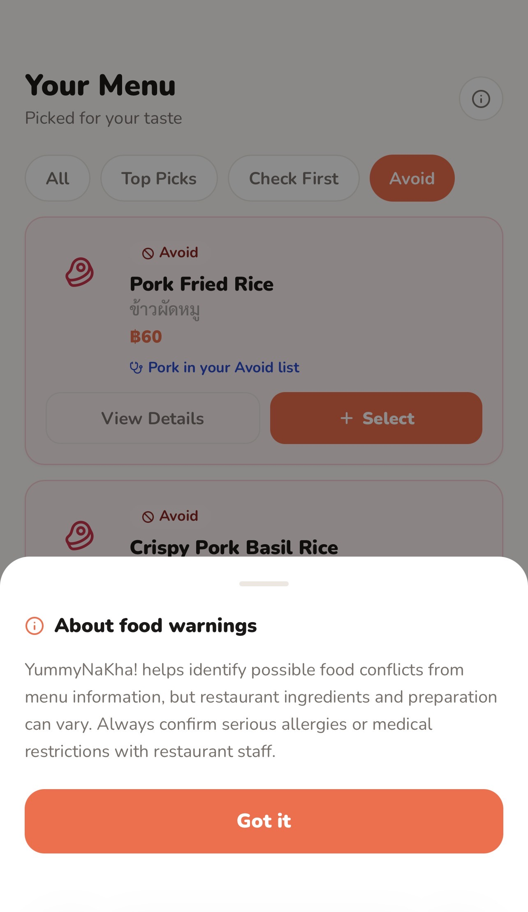

> "YummyNaKha! helps identify possible food conflicts from menu information,
> but restaurant ingredients and preparation can vary. Always confirm serious
> allergies or medical restrictions with restaurant staff."

Dismissed with `Got it`. This is the prototype's **AI & Accuracy Disclaimer**
surface (LR11, LR12) — see gap **G1** for what it does not yet do.

### S9 · Dish Detail — bottom sheet · covers FE6 (F12)

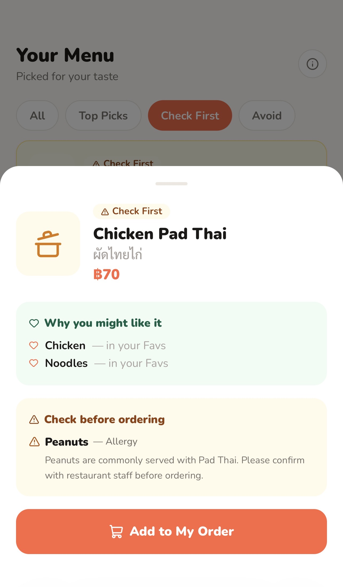
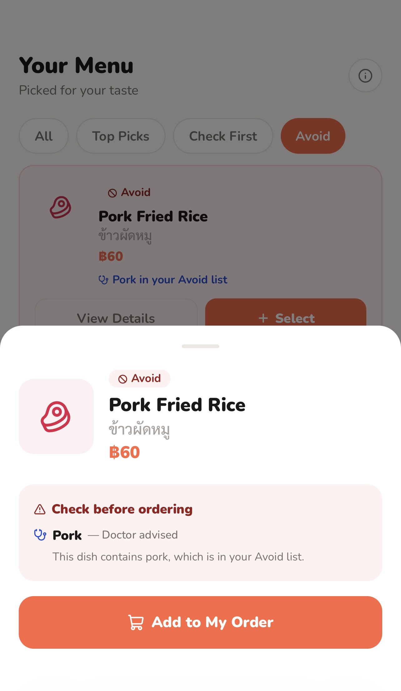

| | |
|---|---|
| **Header** | category badge · English name · Thai name · price |
| **Panel 1 — *Why you might like it*** (green) | every Fav the dish matched, each labelled "— in your Favs". **Absent on an Avoid dish** |
| **Panel 2 — *Check before ordering*** (yellow on Check First, red on Avoid) | the Avoid-list item, its reason, and a sentence of explanation. Check First example: "**Peanuts** — Allergy · Peanuts are commonly served with Pad Thai. Please confirm with restaurant staff before ordering." Avoid example: "**Pork** — Doctor advised · This dish contains pork, which is in your Avoid list." |
| **Actions** | `🛒 Add to My Order` · tap the backdrop to close |
| **States** | *Top Pick* (panel 1 only) · *Check First* (both panels) · *Avoid* (panel 2 only) |
| **Traces** | F11, F12, LR12 — **and gap G3**, because the Avoid wording omits the confirm-with-staff sentence |

### S10 · My Order · covers FE7 (F13)

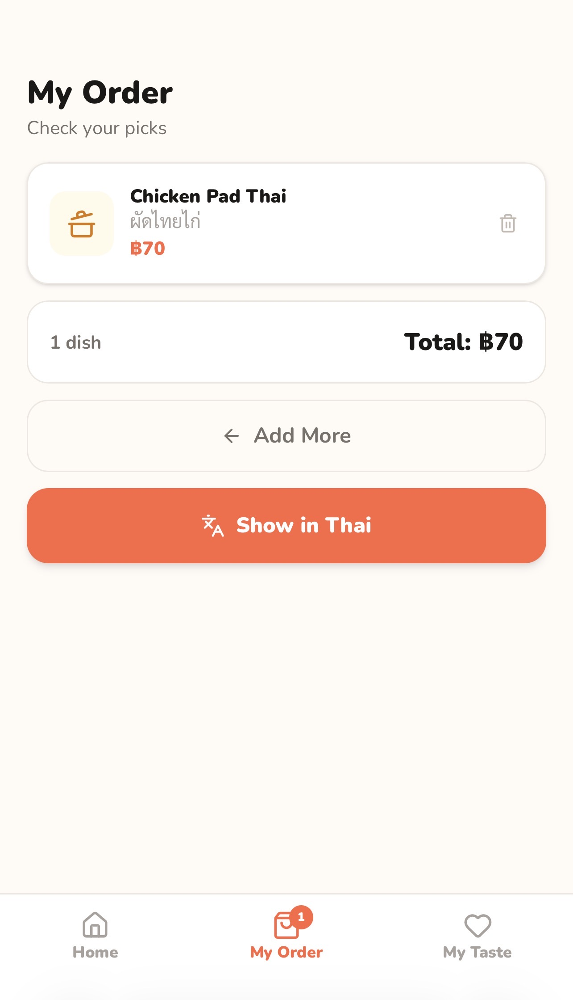

| | |
|---|---|
| **Copy** | *My Order* · "Check your picks" |
| **Row** | thumbnail · English name · Thai name · price · delete (🗑) |
| **Summary** | "N dish / Total: ฿X" |
| **Actions** | `← Add More` → S8 · `Show in Thai` → S10a |
| **States** | *empty* · *1+ items*; the `My Order` tab shows a count badge |
| **Traces** | F13 |

### S10a · Order in Thai · covers FE7 (F14)

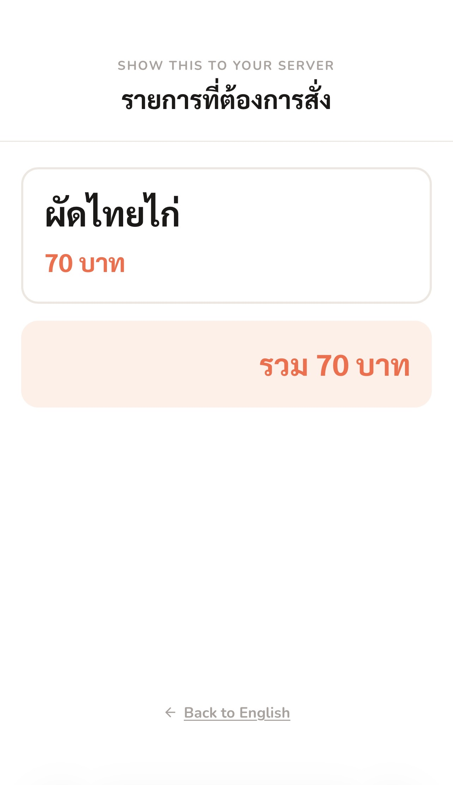

| | |
|---|---|
| **Copy** | `SHOW THIS TO YOUR SERVER` · **รายการที่ต้องการสั่ง** |
| **Card** | the dish name **in Thai only**, in a very large type size, with the price as `70 บาท` |
| **Total** | `รวม 70 บาท` |
| **Chrome** | no bottom tab bar — the screen is deliberately bare so it reads at arm's length across a table |
| **Actions** | `← Back to English` → S10 |
| **States** | one state; reached without re-running the analysis |
| **Traces** | F14, P2 |

### S11 · My Profile · covers FE1 (F4)

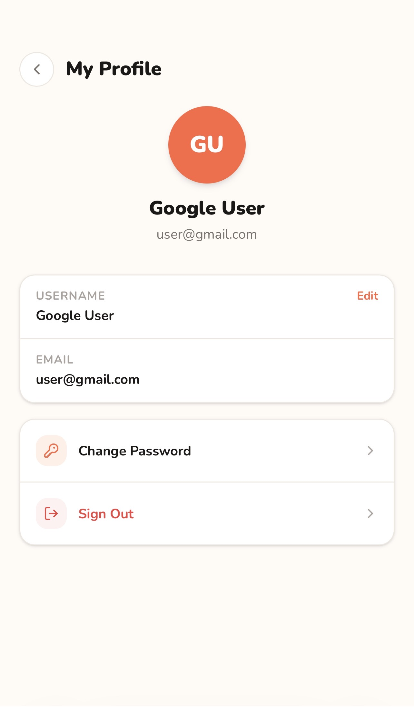

| | |
|---|---|
| **Copy** | *My Profile* |
| **Shows** | avatar with initials · display name · email |
| **Fields** | `USERNAME` with an `Edit` link · `EMAIL` (read-only) |
| **Actions** | `Change Password` → S12 · `Sign Out` → S1 · `‹` back |
| **States** | *view* · *username editing* |
| **Traces** | F4 — **and gap G4**: there is no *Delete account* control |

### S12 · Change Password · covers FE1 (LR6)

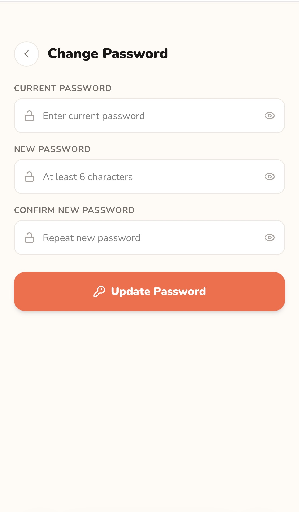

| | |
|---|---|
| **Fields** | `CURRENT PASSWORD` · `NEW PASSWORD` ("At least 6 characters") · `CONFIRM NEW PASSWORD`, each with a show/hide eye |
| **Actions** | `🔑 Update Password` · `‹` back |
| **States** | *empty* · *filled* · *mismatch / too short* error |
| **Traces** | F1, LR6 |

---

## Sample data built into the prototype

The demo profile is Favs *Chicken · Cheese · Spicy · Noodles · Banana* and an
Avoid list of *Peanuts (Allergy) · Pork (Doctor advised) · Mushroom (Just
avoid)*. It runs against two mock images, `menu-page-1.jpg` and
`menu-page-2.jpg`, and always returns the same seven dishes:

| # | English | Thai | Price | Category | Reason shown |
|---|---|---|---|---|---|
| 1 | Chicken Basil Rice | กะเพราไก่ | ฿60 | Top Pick | ♡ Chicken, ♡ Spicy |
| 2 | Chicken Noodle Soup | ก๋วยเตี๋ยวไก่ | ฿55 | Top Pick | ♡ Chicken, ♡ Noodles |
| 3 | Shrimp Fried Rice | ข้าวผัดกุ้ง | ฿75 | Top Pick | ♡ Spicy |
| 4 | Chicken Pad Thai | ผัดไทยไก่ | ฿70 | Check First | ⚠ Peanuts in your Avoid list |
| 5 | Chicken with Mushrooms | ผัดเห็ดไก่ | ฿70 | Check First | Mushroom in your Avoid list |
| 6 | Pork Fried Rice | ข้าวผัดหมู | ฿60 | Avoid | 🩺 Pork in your Avoid list |
| 7 | Crispy Pork Basil Rice | กะเพราหมูกรอบ | ฿65 | Avoid | 🩺 Pork in your Avoid list |

Every dish carries both a Thai and an English name and a visible price, so the
prototype does **not** yet exercise the missing-price case (journey path A9) or
the too-many-Check-First risk.

---

## Interaction rules the prototype establishes

1. **An Avoid dish is never blocked.** `+ Select` and `Add to My Order` are
   live on every card, including red ones. The app warns; the diner decides.
2. **A conflict is always attributed.** Every Check First and Avoid card names
   the profile item behind it, so the diner can judge the result (F12, P4).
3. **Sorting is fixed, not user-controlled** — Top Picks first, Avoid last, in
   every filter view.
4. **The reason chosen in the Avoid list changes the result wording**, not just
   the badge: *Allergy* → ⚠ amber, *Doctor advised* → 🩺 blue, *Just avoid* →
   plain grey text.
5. **The Thai order screen never re-runs the analysis** and never shows English
   (F14).
6. **Nothing in the UI claims a dish is safe**, and no score or percentage is
   shown anywhere (LR11, LR12).

---

## Diagrams

### Context diagram

Who and what sits outside YummyNaKha!, and exactly what crosses the boundary.


Editable source: [`Context.mmd`](Context.mmd)

### Use case diagram


Editable source: [`UseCaseDiagram.mmd`](UseCaseDiagram.mmd)

### Activity diagram — main user activity

Shows the authentication branch, the taste-profile branch, the readable-image
branch, the branch that decides between the three result categories, and the
browse/order loop.

Two things to read carefully:

- **The dashed red node is the consent gate** — disclose the transfer and take
  consent *before* any menu or profile data leaves the app. It is required by
  LR2 and is **not in the prototype** (gap **G1**); it is drawn so the missing
  step is visible rather than silently absent.
- **The uncertainty branch is explicit.** A dish only reaches 🟢 Top Picks when
  there is no conflict *and* the menu information is complete; anything
  uncertain or incomplete resolves to 🟡 Check First, never to 🟢 (F10, LR12).


Editable source: [`ActivityDiagram.mmd`](ActivityDiagram.mmd)

### Architecture diagram — logical architecture


Editable source: [`Architecture.mmd`](Architecture.mmd)

The trade-off below is also written into the diagram itself, as the boxed
*Trade-off* note at the top.

**The explicit trade-off:** every OCR, translation and ingredient-inference
call is made **from the API layer, never from the browser**. That costs a
network hop and makes the app useless offline, and it is accepted because it is
the only way to keep the provider key out of the client bundle and to send the
provider menu text plus profile flags **only** — never the account email or
real name (LR3, LR6d).

A second, smaller trade-off is visible in the prototype: **the uploaded image
lives in `Image Storage` for the scan session only**, so a diner cannot reopen
an old scan. That is deliberate — no permanent image store, no scan history
(LR5, F20 Won't).

---

## Prototype vs. requirements — open gaps

Everything below is a real difference between the Version 7 prototype and the
approved spec. None of it is a decision to drop a requirement; it is what has
**not been built into the prototype yet** and must be resolved before the W5
gate.

| # | Gap | Requirement affected | Where |
|---|---|---|---|
| **G1** | **No consent & disclosure gate.** There is no Terms screen, no privacy notice, no separate consent for sending data to the third-party OCR/AI provider, and no stored, versioned acceptance or withdrawal record. The *About food warnings* sheet carries accuracy wording but is dismissible, optional, and appears **after** the menu has already been processed | **F15, F16, LR2, LR9** — the whole of FE2 | between S6 and S7 |
| **G2** | **Health data is not behind a separate explicit opt-in.** Allergies and doctor-advised restrictions are added in the same list and the same flow as ordinary dislikes; the reason sheet is labelled "Optional" and pre-selects *Just don't like it* | **F3, LR1** | S5, S5a |
| **G3** | **The Avoid dish detail omits the confirm-with-staff instruction.** The Check First example carries "Please confirm with restaurant staff before ordering."; the Avoid example says only "This dish contains pork, which is in your Avoid list." | **F11, LR12**, FE6 AC1 | S9 |
| **G4** | **No account deletion.** My Profile offers Edit username, Change Password and Sign Out only | **F17, LR5**, FE9 AC1 | S11 |
| **G5** | **No failure or degradation screens.** The prototype prevents an empty scan by hiding the CTA, but there is no unreadable-photo message, no not-a-Thai-menu message, no provider-outage message, and no review / crop / retry on the still-visible image | **F18, F26, LR5, NFR7** — the whole of FE8 | after S6 |
| **G6** | **Menu upload is mocked.** Two fixed file rows stand in for real images, and the analysis always returns the same seven dishes, so extraction and translation accuracy (NFR2, NFR3) cannot be exercised in the prototype | F5, F6, F7, NFR2, NFR3 | S6, S7 |
| **G7** | **No visible latency behaviour.** The six analysis steps run on a fixed timer, so the ≤ 10 s target is neither demonstrated nor contradicted | NFR5 | S7 |
| **G8** | **Reset password has no confirmation state**, so a diner cannot tell the link was sent | F1, NFR8 | S4 |

**Nothing in the prototype breaks the safety rule.** No screen states that a
dish is safe, no score or percentage appears, and there is no "certified",
"nutritionist-approved", "doctor-approved" or "100% accurate" claim anywhere.
G3 is a *missing* instruction, not a false claim.

---

## Designer's visual file

| | |
|---|---|
| Figma Make prototype (source of truth for this document) | <https://www.figma.com/make/NEV4YbRQ9WN1m3MDkAdZsp/Execute-action> — "Execute action", Version 7 |
| Figma design file (static frames, component library) | `TBD` — not created yet |
| Screenshots in this document | [`images/`](images/), exported from the running prototype on 2026-09-08 |

## Screen ↔ feature coverage check

| Feature | Screens |
|---|---|
| FE1 — Account & Food Profile | S1, S2, S3, S4, S5, S5a, S11, S12 |
| FE2 — Consent & Disclosure Gate | **none — gap G1** |
| FE3 — Menu Capture & Extraction | S6, S7 |
| FE4 — Menu Translation | S7, S8 |
| FE5 — Ingredient Inference & Profile Matching | S7, S8, S9 |
| FE6 — Result Presentation & Safety Wording | S8, S8a, S9 |
| FE7 — Selection & Order in Thai | S8, S10, S10a |
| FE8 — Failure & Degradation Handling | **none — gap G5** |
| FE9 — Data Rights & Compliance Layer | S5 (edit/delete rows), S11 (partial) — **deletion missing, gap G4** |

Every **Must** feature except **FE2** and **FE8** has at least one screen in the
prototype.
