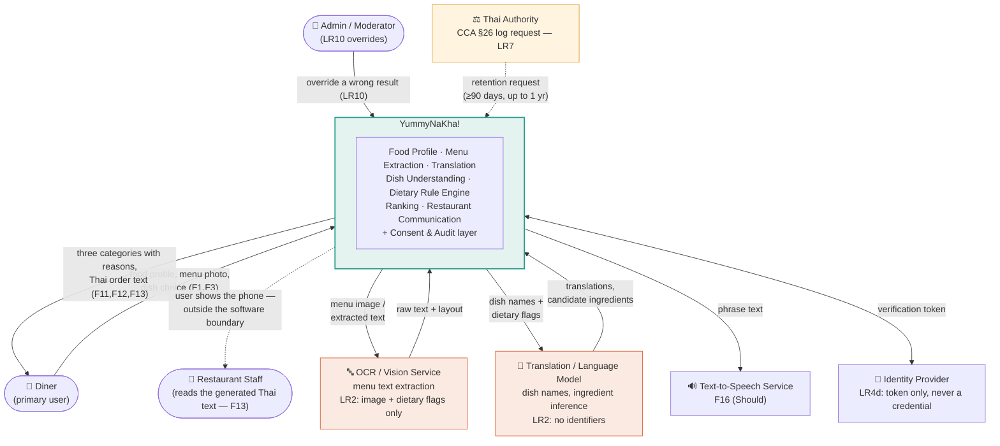

# Diagram 1 of 4 — Context

What we build versus what we call. One box for the system, everything else
outside it.

## What this diagram settles

| Boundary decision | Why |
|---|---|
| **The restaurant is not an actor that feeds the system** | Staff appear only as the *reader* of generated text, over a dotted line — they never register, upload a menu, install a QR code, or maintain data. That is the project's founding constraint, and the diagram has to show it or the constraint is just a claim. |
| OCR and the language model are **outside** the box | We call third-party services; we do not train or host them. This is what makes LR2 (transfer disclosure + minimisation) necessary at all. |
| The **dietary rule engine, ranking, and uncertainty logic are inside** the box | They are ours, and they are the answer to "is this just an AI API wrapper?". The models return *candidates*; the verdict is computed by our code. |
| Identity is **outside** the box | We never store a password — only a verification token (LR4d). |
| The consent & audit layer is **inside** the box | Compliance is our system's job, not a vendor's. |
| The Thai authority is an actor, not a user | CCA §26 makes log retention a real external interface, not an internal nicety (LR7). |

**Data leaving the system:** the menu image (or the text extracted from it),
dish names, and dietary flags — and nothing else. No name, email, phone number,
or device identifier crosses the boundary to any third-party service (LR2). The
raw image is deleted within 24 hours of successful extraction (LR3, NFR13),
because a photo of a restaurant table is rarely a photo of only the menu.
