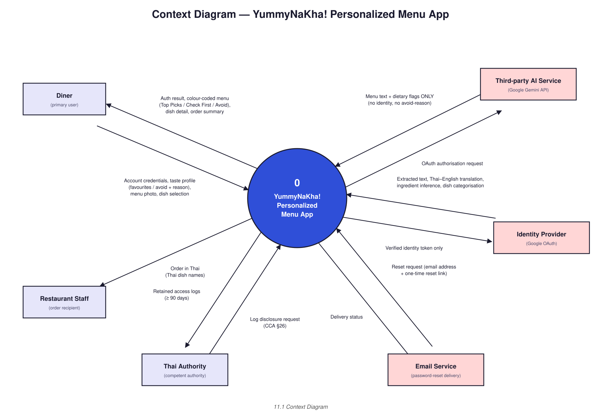

# Diagram 1 of 4 — Context

Shows YummyNaKha! as one box against everything outside it: the **Diner**
(primary actor), the **third-party AI service** (Google Gemini API) called to
read and categorize the menu — which receives menu text plus dietary flags
**only**, never identity (LR3) — the **identity provider** used for OAuth
sign-in and token exchange (LR6), and the **Thai authority** that may request
traffic-log data retained for ≥ 90 days under CCA §26 (LR7).

