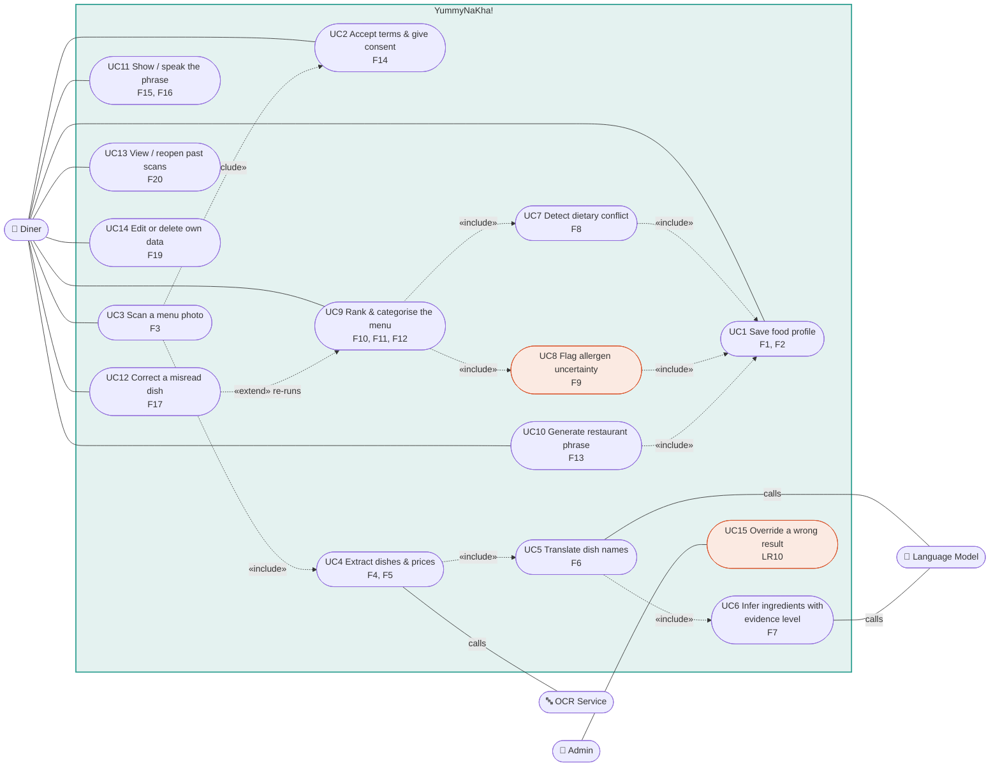

# Diagram 2 of 4 — Use Case

Actors and what each can do. Every use case maps to `F` items in the spec.

## Use case ↔ requirement map

| UC | Use case | Traces | MoSCoW |
|----|----------|--------|--------|
| UC1 | Save food profile | F1, F2, LR1, P3 | Must |
| UC2 | Accept terms & give consent | F14, LR2, LR8 | Must |
| UC3 | Scan a menu photo | F3, LR2, LR3, P1 | Must |
| UC4 | Extract dishes & prices | F4, F5, P1 | Must |
| UC5 | Translate dish names | F6, P1 | Must |
| UC6 | Infer ingredients with evidence level | F7, P2 | Must |
| UC7 | Detect dietary conflict | F8, P2 | Must |
| UC8 | Flag allergen uncertainty | F9, LR10, P2 | Must |
| UC9 | Rank & categorise the menu | F10, F11, F12, LR9, P1, P3 | Must |
| UC10 | Generate restaurant phrase | F13, LR4e, LR9, P4 | Must |
| UC11 | Show / speak the phrase | F15, F16, P4 | Should |
| UC12 | Correct a misread dish | F17, LR6, P1 | Should |
| UC13 | View / reopen past scans | F20, P3 | Should |
| UC14 | Edit or delete own data | F19, LR4c, LR6, P2 | Should |
| UC15 | Override a wrong result | LR10 | Must |

## The relationships that matter

- **UC3 «include» UC2** — a menu cannot be scanned before consent exists. The
  include is not a convenience; it is LR2 expressed as structure. There is no
  path to the OCR service that skips it.
- **UC4 → UC5 → UC6 is a chain, not a choice** — extraction, translation, and
  ingredient inference always run in that order, because a dish cannot be
  matched against a profile before the system knows what the dish is. This chain
  is the pipeline the Brief calls for, made explicit.
- **UC7 and UC8 both «include» UC1** — every verdict is computed against the
  saved profile. There is no generic "is this dish OK" answer in the system;
  the answer only exists relative to a person.
- **UC7 and UC8 are separate use cases on purpose** — a detected restriction
  (UC7 → *Conflict*) and an inferred allergen (UC8 → *Check Before Ordering*)
  are different outcomes with different evidence. Merging them into one
  "check dish" use case is exactly the design mistake LR10 and NFR6 exist to
  prevent.
- **UC9 «include» UC7 + UC8** — ranking never overrides a conflict or an
  allergen warning. Preferences reorder the Recommended list; they cannot
  promote a dish out of Conflict.
- **UC12 «extend» UC9** — correcting one misread dish re-runs the analysis for
  that dish only, so a single OCR error does not cost the user a whole rescan.
