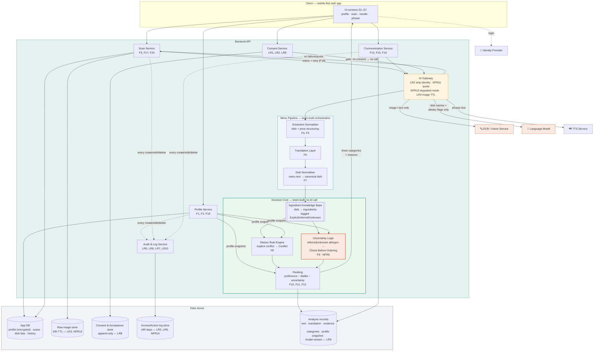

# Diagram 3 of 4 — Architecture

Components, data stores, and where compliance lives.
**The course rubric requires one explicitly stated trade-off — see below.**

## Key structural decisions

| Decision | Reason |
|---|---|
| **The Decision Core makes no AI call at all** | The rule engine, uncertainty logic, and ranking take structured input and produce the verdict deterministically. This is the direct answer to the Brief's warning against being an AI API wrapper — and it is also what makes NFR5's 100% recall testable, because the same input always yields the same category. |
| **AI Gateway is its own component** | One chokepoint where identity is stripped (LR2), quota is enforced (NFR11), degraded mode fires (NFR10), and the raw image TTL is applied (LR3). Compliance in one testable place instead of scattered through the pipeline. |
| **Ingredient Knowledge Base is a data store, not a prompt** | Dish → ingredient mappings live in our own reviewable, versionable store with an evidence tag per ingredient. A model *suggests* candidates; the KB is what the engine reads. A wrong mapping can be fixed by editing a row rather than by re-tuning a prompt. |
| **Uncertainty Logic is a component, not an `if`** | The rule that an Inferred allergen can never reach Recommended (NFR6) is the product's safety posture. It sits in one place so it can be unit-tested and so no future feature can quietly bypass it. |
| **Ranking runs after the rule engine, never around it** | Preferences reorder the Recommended list; they cannot promote a dish out of Conflict or out of Check Before Ordering. Hard restrictions and allergen warnings are not preference weights. |
| **Raw images in a separate store with a TTL** | Menu photos catch faces, receipts, and name cards. A 24-hour TTL on its own store makes LR3 an infrastructure guarantee instead of a cleanup job someone forgets. |
| **Five separate stores, not one** | Logs must survive content deletion (LR6), consent must be append-only (LR8), analysis records must be reproducible after the scan is deleted (LR9), and raw images must expire fastest (LR3). Four different lifecycles cannot share a table. |
| **Consent Service gates the gateway** | LR2 is enforced by the call graph — an ungated path to the OCR or language service does not exist. |
| **Profile encrypted at rest** | Allergies and dietary restrictions are sensitive data under PDPA (LR1). |

## Stated trade-off *(required by the rubric)*

> **We call third-party OCR and language models instead of training our own
> menu-reading and dish-understanding models — but we keep the dietary verdict
> in our own deterministic code.**
>
> **We gain:** a working Thai menu reader in month 2 with no ML training, no
> labelled menu corpus, and no GPU budget. A 5-person team with a 3-week build
> cannot train an OCR model for stylised Thai menu photography *and* ship the
> workflow. Splitting the system this way also means the part that must be
> **100% correct** (NFR5 explicit-conflict recall) is the part we wrote and can
> unit-test, while the part that is allowed to be ~90% (extraction, NFR2) is the
> part we bought.
>
> **We pay:** per-call cost and rate limits (NFR11 caps free-tier users at 40
> scans/month), an availability dependency we do not control (NFR10 forces a
> plain-language degraded mode instead of a raw error), a PDPA cross-border
> transfer that requires disclosure, consent, and data minimisation (LR2), and
> an accuracy ceiling on real photographed menus that we can only improve by
> preprocessing and correction (F17), not by retraining. The Charter names OCR
> quality and third-party cost/availability as top risks; NFR2, NFR10, and
> NFR11 are the direct answers.
>
> **Revisit when:** extraction accuracy on real Thai menus plateaus below NFR2's
> 90% and the failures are systematic (a font, a layout, a lighting condition)
> rather than random — at that point a small fine-tuned model on our own
> collected menu set beats another round of prompt work. Also revisit if
> per-scan cost exceeds the free tier at pilot scale.
