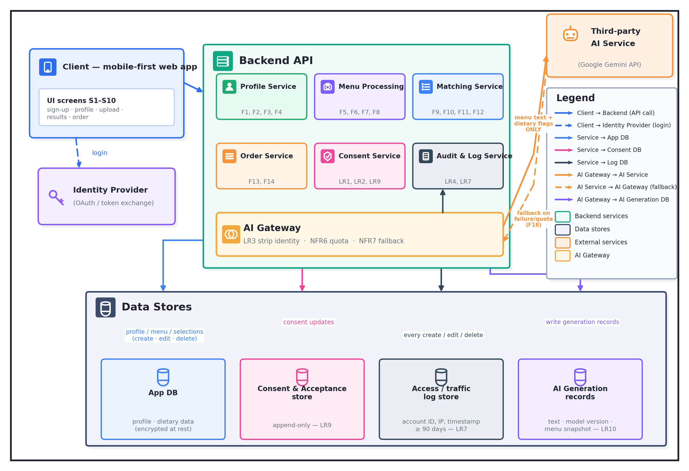

# Diagram 3 of 4 — Architecture

Shows the client, the backend services behind it, and the data stores they
write to:

- **Client** — the mobile-first web app, screens S1–S10.
- **Identity Provider** — OAuth sign-in and token exchange (LR6).
- **Backend API** — Profile Service (F1–F4), Menu Processing Service (F5–F8),
  Matching Service (F9–F12), Order Service (F13, F14), Consent Service (LR1,
  LR2, LR9) and Audit & Log Service (LR4, LR7), sitting above an **AI Gateway**
  that strips identity before every outbound call (LR3), enforces the quota
  (NFR6) and produces the plain-language fallback when the provider fails
  (NFR7, F18).
- **Third-party AI Service** — Google Gemini API; receives menu text plus
  dietary flags only.
- **Data stores** — App DB (profile and dietary data, encrypted at rest), the
  append-only consent and acceptance store (LR9), the access/traffic log store
  kept ≥ 90 days (LR7), and the AI generation records (LR10).

**The explicit trade-off:** every OCR, translation and ingredient-inference
call is made **from the API layer, never from the browser**. That costs a
network hop and makes the app useless offline, and it is accepted because it is
the only way to keep the provider key out of the client bundle and to send the
provider menu text plus dietary flags **only** — never the account email or
real name (LR3, LR6).

A second, smaller trade-off: **the uploaded image lives in storage for the scan
session only**, so a diner cannot reopen an old scan. That is deliberate — no
permanent image store, no scan history (LR5, F20 Won't).

