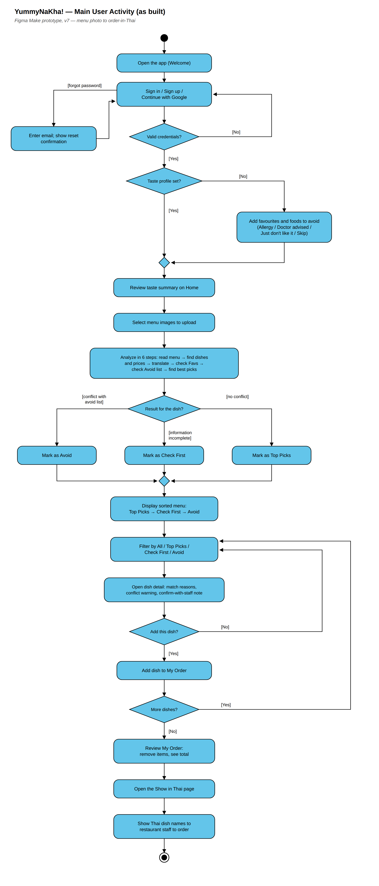

# Diagram 4 of 4 — Activity

Shows the core workflow as a single flow with its decision points: sign-in and
food profile, the **consent gate** that must disclose the transfer and take
consent _before_ any menu or profile data leaves the app (LR1, LR2, F15), the
readable-image check, the AI call through the gateway with menu text and
dietary flags only (LR3), the **quota / AI-availability branch** that ends in a
plain-language message rather than a failure (NFR6, NFR7, F18), the branch that
sorts every dish into Recommended, Check First or Avoid — anything uncertain or
incomplete resolves to Check First, never to Recommended (F10, LR12) — and the
selection and Thai order screen, which never re-runs the analysis and never
shows English (F13, F14).

