# Diagram 4 of 4 — Activity

The core workflow as a flow, with every decision point.
This is where the consent step (LR1/LR2), the three evidence levels, the
conflict branch, the allergen-uncertainty branch, and the outage fallback become
visible, rather than just claimed in prose.

```mermaid
flowchart TD
    start([User opens YummyNaKha!]) --> hasProfile{Food profile<br/>exists?}
    hasProfile -->|No| buildProfile["Build profile:<br/>allergies · restrictions ·<br/>dislikes · preferences · language<br/>F1 · F2 · NFR8 &lt;3 min"]
    buildProfile --> optIn[/"Explicit separate opt-in for<br/>allergy &amp; restriction data<br/>LR1 · LR8"/]
    optIn --> hasProfile
    hasProfile -->|Yes| tapScan["User taps 'Scan menu'<br/>F3"]

    tapScan --> consent{Terms accepted<br/>AND transfer consent<br/>given?<br/>LR2 · LR8}
    consent -->|No| showConsent["Show what is sent:<br/>menu image + dietary flags.<br/>What is never sent: identity.<br/>Disclaimer: we read the menu,<br/>not the kitchen.<br/>Two separate checkboxes"]
    showConsent --> agreed{User<br/>agrees?}
    agreed -->|No| noScan["No scan. Profile stays saved.<br/>Nothing is sent anywhere"]
    agreed -->|Yes| storeConsent[/"Store acceptance:<br/>user id, timestamp, version<br/>LR8"/]
    storeConsent --> quota
    consent -->|Yes| quota{Under quota?<br/>≤40 scans/month<br/>NFR11}

    quota -->|No| degraded
    quota -->|Yes| photo["User photographs the menu<br/>F3 · no restaurant setup"]
    photo --> logUpload[/"Log: account, IP, timestamp<br/>LR5"/]
    logUpload --> svcUp{OCR / language<br/>service reachable?}

    svcUp -->|No| degraded["DEGRADED MODE within 5s:<br/>plain notice + retry.<br/>No raw error. No partial menu<br/>shown as complete.<br/>F18 · NFR10"]
    degraded --> tapScan

    svcUp -->|Yes| extract["Gateway strips identity, sends<br/>image / text only · LR2<br/>→ extract dish names + prices<br/>F4 · F5 · NFR2 ≥90%"]
    extract --> extractOk{Enough dishes<br/>extracted?}
    extractOk -->|No| retryPhoto["Ask for a clearer photo.<br/>Never return a short list as<br/>if it were the whole menu"]
    retryPhoto --> photo
    extractOk -->|Yes| purgeImg[/"Raw image TTL starts:<br/>deleted within 24h<br/>LR3 · NFR13"/]
    purgeImg --> translate["Translate dish names into<br/>the preferred language<br/>F6 · NFR4"]
    translate --> understand["Dish Normaliser + Knowledge Base:<br/>map each dish to ingredients<br/>F7"]

    understand --> evidence{Evidence level<br/>per ingredient?}
    evidence -->|"Explicit<br/>(in the menu text)"| explicitCheck{Matches a dietary<br/>restriction?}
    evidence -->|"Inferred<br/>(common in this dish)"| inferCheck{Matches an<br/>allergy?}
    evidence -->|"Unknown"| unknownPath

    explicitCheck -->|Yes| conflict["✗ CONFLICT<br/>'contains pork'<br/>F8 · NFR5 recall = 100%"]
    explicitCheck -->|No| scoreIt

    inferCheck -->|Yes| checkFirst["⚠ CHECK BEFORE ORDERING<br/>'may contain or commonly be<br/>served with your allergen —<br/>confirm with staff'<br/>F9 · NFR6 · LR10"]
    inferCheck -->|No| dislikeCheck{Matches a<br/>dislike?}
    dislikeCheck -->|Yes| scoreIt
    dislikeCheck -->|No| scoreIt

    unknownPath["Unknown ingredients →<br/>uncertainty penalty;<br/>allergy-relevant unknown →<br/>Check Before Ordering<br/>F7 · NFR6"] --> scoreIt

    scoreIt["RANK: preference match<br/>− dislike penalty<br/>− uncertainty penalty<br/>F10 · conflicts are NOT<br/>blended into this score"]
    scoreIt --> categorise["Categorise the whole menu:<br/>★ Top Match / Recommended /<br/>⚠ Check Before Ordering / ✗ Conflict<br/>+ a reason line per dish<br/>F11 · F12 · NFR7 &lt;15s p90"]
    conflict --> categorise
    checkFirst --> categorise

    categorise --> storeAnalysis[/"Store: extracted text, translation,<br/>inferences + evidence levels,<br/>categories, profile snapshot,<br/>model version, timestamp<br/>LR9"/]
    storeAnalysis --> showResults["Show results.<br/>No score. No percentage.<br/>No safety claim anywhere<br/>NFR6 · LR10"]

    showResults --> misread{Dish misread?}
    misread -->|Yes| correct["Correct the name / price in place;<br/>re-run that dish only<br/>F17"]
    correct --> understand
    misread -->|No| pick{User picks<br/>a dish?}
    pick -->|"No — all conflict"| askAnyway["Generate a Thai question so the<br/>user can ask for a modification<br/>F13"]
    askAnyway --> phrase
    pick -->|Yes| needAsk{Needs to ask<br/>about an allergen?}

    needAsk -->|Yes| phrase["Generate restaurant-ready Thai:<br/>allergen question, or order with<br/>modifications from the profile<br/>F13 · NFR9 &lt;3s"]
    needAsk -->|No| phrase
    phrase --> minimal[/"Reveal one dish + one restriction —<br/>never the full allergy list<br/>LR4e"/]
    minimal --> storePhrase[/"Store phrase, language, dish,<br/>timestamp · LR9"/]
    storePhrase --> show["Show full-screen to staff<br/>or play as speech<br/>F15 · F16"]
    show --> ordered([Dish ordered.<br/>Time-to-decide ↓ ≥50%<br/>NFR1])

    style consent fill:#FFF4E0,stroke:#E1972B,stroke-width:2px
    style showConsent fill:#FFF4E0,stroke:#E1972B
    style evidence fill:#F0F7FB,stroke:#4A7EA8,stroke-width:2px
    style conflict fill:#FBEAE2,stroke:#D9542B,stroke-width:2px
    style checkFirst fill:#FBEAE2,stroke:#D9542B,stroke-width:2px
    style inferCheck fill:#FBEAE2,stroke:#D9542B
    style unknownPath fill:#FBEAE2,stroke:#D9542B
    style degraded fill:#E4F2F0,stroke:#2A9D8F,stroke-width:2px
    style storeAnalysis fill:#F3F4F7,stroke:#6A7686
    style storeConsent fill:#F3F4F7,stroke:#6A7686
    style optIn fill:#F3F4F7,stroke:#6A7686
    style logUpload fill:#F3F4F7,stroke:#6A7686
    style purgeImg fill:#F3F4F7,stroke:#6A7686
    style storePhrase fill:#F3F4F7,stroke:#6A7686
    style minimal fill:#F3F4F7,stroke:#6A7686
```

## Reading the diagram

| Shape | Meaning |
|---|---|
| `{ diamond }` | Decision point |
| `[/ parallelogram /]` | A legally required record is written or a retention rule fires (LR1, LR3, LR5, LR8, LR9) |
| Amber | Consent gate — LR1, LR2, LR8 |
| Blue | The evidence-level split — Explicit / Inferred / Unknown |
| Red | Dietary and allergen outcomes — NFR5, NFR6, the parts that must not be wrong |
| Green | Availability degraded mode — F18, NFR10 |

## The five branches that matter at the gate

1. **No consent → nothing is sent.** There is no path from "tap scan" to the
   OCR or language service that skips the consent diamond. LR2 is structural,
   not a promise.

2. **The evidence level decides the category, not the model's confidence.**
   Explicit ingredients can produce a Conflict. Inferred and Unknown ones
   produce *Check Before Ordering* when they touch an allergy. This single
   branch is what stops an AI guess from being shown as a fact, and it is the
   diagram's most important structure.

3. **Ranking runs after the rule engine, never around it.** Preference,
   dislike, and uncertainty scores reorder the Recommended list. They enter the
   flow *after* Conflict and Check Before Ordering have already been assigned,
   so no preference score can promote a pork dish for a user who does not eat
   pork.

4. **No clean result is ever a safety claim.** The path out of the rule engine
   leads to a category and a reason line — never to a score, a percentage, or
   the word "safe" (NFR6, LR10). The best outcome the system can express is
   "no conflicting ingredient was detected from the available menu information".

5. **A failure fails loudly, or not at all.** Both the outage branch and the
   poor-extraction branch refuse to show a partial menu as if it were complete
   (F18, NFR10). Half a menu is more dangerous than no menu when the missing
   half is the half with pork in it.
